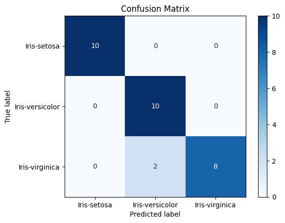
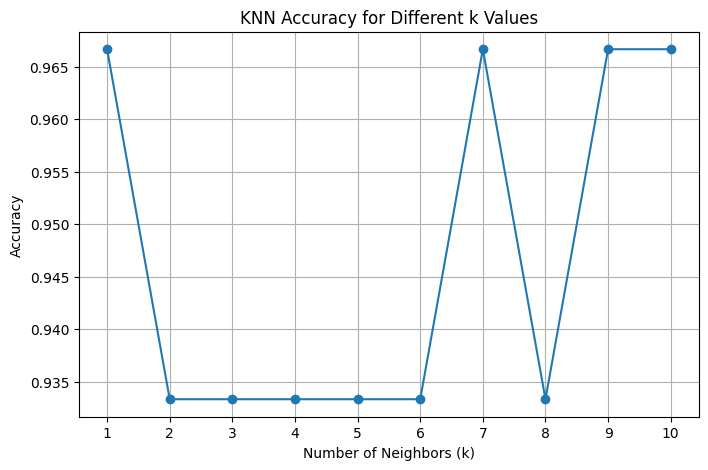
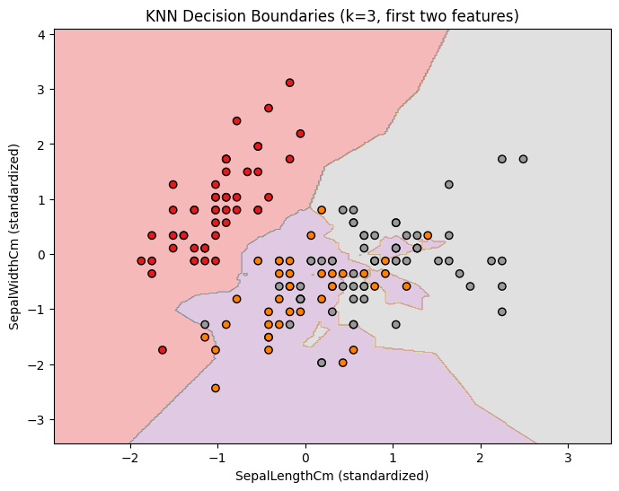

# Iris Flower Classification with K-Nearest Neighbors

This project demonstrates the use of the K-Nearest Neighbors (KNN) algorithm to classify iris flowers into species based on their morphological measurements. It covers data preprocessing, model evaluation, hyperparameter tuning, and visualization of decision boundaries.

---

## Dataset

- **Download Link:** https://www.kaggle.com/datasets/uciml/iris
- **File:** `Iris.csv`
- **Rows:** 150
- **Features:** 4 (SepalLengthCm, SepalWidthCm, PetalLengthCm, PetalWidthCm)
- **Target:** `Species` (Iris-setosa, Iris-versicolor, Iris-virginica)

---

## Workflow

### 1. Data Loading and Inspection
```
import pandas as pd
df = pd.read_csv('Iris.csv')
print(df.info())
print(df.head())
print(df.isnull().sum())
```
*Checked for missing values and confirmed all features are numeric.*

---

### 2. Data Preprocessing

Drop the 'Id' column
```
df = df.drop('Id', axis=1)
```

Separate features and target
```
X = df.drop('Species', axis=1)
y = df['Species']
```

Standardize features
```
from sklearn.preprocessing import StandardScaler
scaler = StandardScaler()
X_scaled = scaler.fit_transform(X)
```
*Removed unnecessary columns and standardized features for optimal KNN performance.*

---

### 3. Train-Test Split
```
from sklearn.model_selection import train_test_split
X_train, X_test, y_train, y_test = train_test_split(
X_scaled, y, test_size=0.2, random_state=42, stratify=y)
```
*Split data for unbiased model evaluation.*

---

### 4. K-Nearest Neighbors Classifier
```
from sklearn.neighbors import KNeighborsClassifier
knn = KNeighborsClassifier(n_neighbors=3)
knn.fit(X_train, y_train)
```
*Trained a basic KNN classifier with k=3.*

---

### 5. Model Evaluation
```
from sklearn.metrics import accuracy_score, confusion_matrix, classification_report
y_pred = knn.predict(X_test)
print("Accuracy:", accuracy_score(y_test, y_pred))
print(confusion_matrix(y_test, y_pred))
print(classification_report(y_test, y_pred))
```

*Evaluated predictions with accuracy, confusion matrix, and classification report.*

---

### 6. Hyperparameter Tuning
```
import matplotlib.pyplot as plt
accuracies = []
for k in range(1, 11):
knn_k = KNeighborsClassifier(n_neighbors=k)
knn_k.fit(X_train, y_train)
y_pred_k = knn_k.predict(X_test)
acc = accuracy_score(y_test, y_pred_k)
accuracies.append(acc)

plt.plot(range(1, 11), accuracies, marker='o')
plt.title('KNN Accuracy for Different k Values')
plt.xlabel('Number of Neighbors (k)')
plt.ylabel('Accuracy')
plt.grid(True)
plt.show()
```

*Tested multiple k values to find the optimal number of neighbors.*

---

### 7. Decision Boundary Visualization

Use only the first two features
```
import numpy as np
X_vis = X_scaled[:, :2]
X_train_vis, X_test_vis, y_train_vis, y_test_vis = train_test_split(
X_vis, y, test_size=0.2, random_state=42, stratify=y)

knn_vis = KNeighborsClassifier(n_neighbors=3)
knn_vis.fit(X_train_vis, y_train_vis)

x_min, x_max = X_vis[:, 0].min() - 1, X_vis[:, 0].max() + 1
y_min, y_max = X_vis[:, 1].min() - 1, X_vis[:, 1].max() + 1
xx, yy = np.meshgrid(np.arange(x_min, x_max, 0.02),
np.arange(y_min, y_max, 0.02))

Z = knn_vis.predict(np.c_[xx.ravel(), yy.ravel()])
Z = Z.reshape(xx.shape)
```

Convert class labels to integers for plotting
```
class_labels = knn_vis.classes_
label_to_int = {label: idx for idx, label in enumerate(class_labels)}
Z_int = np.vectorize(label_to_int.get)(Z)

import matplotlib.pyplot as plt
plt.figure(figsize=(8, 6))
plt.contourf(xx, yy, Z_int, alpha=0.3, cmap=plt.cm.Set1)
plt.scatter(X_vis[:, 0], X_vis[:, 1], c=pd.Categorical(y).codes, edgecolor='k', cmap=plt.cm.Set1)
plt.xlabel('SepalLengthCm (standardized)')
plt.ylabel('SepalWidthCm (standardized)')
plt.title('KNN Decision Boundaries (k=3, first two features)')
plt.show()
```

*Visualizes how KNN separates classes based on Sepal Length and Sepal Width.*

---

## Key Insights

- **KNN achieves high accuracy** on the Iris dataset (typically >90%).
- **Optimal k** can be selected via validation (commonly k=3 for this dataset).
- **Decision boundary plots** provide visual intuition for how KNN classifies new samples.
- **Feature scaling is crucial** for distance-based algorithms like KNN.

---

**Author:** Saksham Bindal
